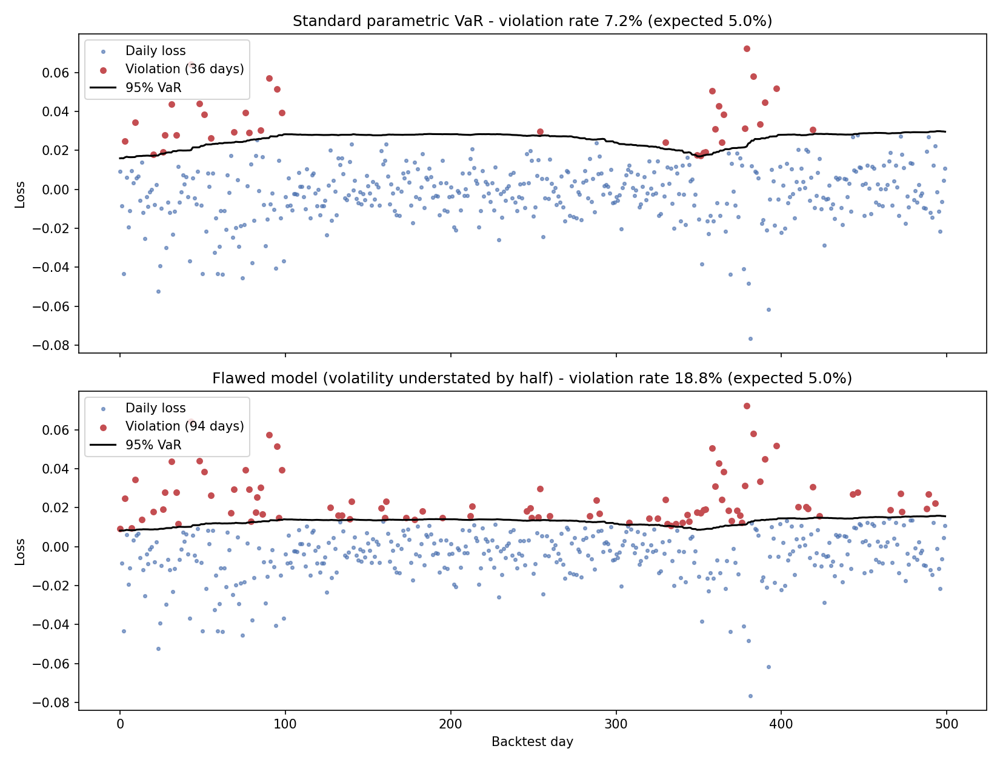

# VaR Backtester

A statistical backtesting engine for VaR (Value at Risk) models, implementing the two
most widely used validation tests in market risk management: the **Kupiec test** and
the **Christoffersen independence test**.

## Why Backtest?

Building a VaR model (see
[var-calculator](https://github.com/ducksmell-sys/var-calculator),
[ewma-calculator](https://github.com/ducksmell-sys/ewma-calculator),
[garch-calculator](https://github.com/ducksmell-sys/garch-calculator)) only tells you
*how* to estimate risk — it says nothing about whether that estimate is actually any
good. Backtesting answers the question regulators and risk committees always ask:
**"Does this model's track record justify trusting it?"**

Basel III explicitly requires banks to backtest their internal VaR models, and this is
one of the most commonly asked practical questions in risk management interviews.

## Methodology

1. **Rolling-window VaR**: for each day, compute VaR using only the preceding `window`
   days of data, then compare it against the *actual* realized loss the next day
2. **Violations**: a day where the actual loss exceeds the predicted VaR
3. **Kupiec test (Proportion of Failures)**: tests whether the observed violation rate
   matches the theoretical rate (`1 - confidence`) — e.g., a 95% VaR model should be
   violated about 5% of the time
4. **Christoffersen independence test**: tests whether violations are *clustered*
   rather than scattered randomly — clustering means the model failed to react to a
   changing risk regime, even if its overall violation rate looks fine
5. **Conditional Coverage test**: combines both into a single test (`LR_Kupiec + LR_Independence`, χ² with 2 degrees of freedom)

### The math

**Kupiec LR statistic:**
```
LR_POF = -2 ln[ (1-p)^(n-x) p^x / (1-p̂)^(n-x) p̂^x ]  ~ χ²(1)
```
where `n` = total days, `x` = violations, `p` = theoretical violation rate, `p̂` = observed rate.

**Christoffersen independence LR statistic:**
```
LR_IND = -2 ln[ L(single transition prob) / L(separate π01, π11) ]  ~ χ²(1)
```
based on a first-order Markov chain of violation/no-violation transitions.

A low p-value (< 0.05) on either test means: **reject the model** — it's not well calibrated.

## Files

| File | Description |
|---|---|
| `backtest.py` | `rolling_backtest`, `kupiec_test`, `christoffersen_independence_test`, `conditional_coverage_test` — demo compares a correctly-specified model against a deliberately flawed one |

## Usage

```bash
pip install numpy scipy matplotlib
python backtest.py
```

Backtest your own VaR function — it just needs the signature `(window_returns, confidence, portfolio_value) -> VaR`:

```python
from backtest import rolling_backtest, kupiec_test, christoffersen_independence_test, conditional_coverage_test

def my_var_model(window_returns, confidence=0.95, portfolio_value=1.0):
    ...  # plug in parametric_var, ewma_var, garch_var, etc. from the other calculators

_, violations, _ = rolling_backtest(returns, my_var_model, window=250, confidence=0.95)

kupiec_test(violations, confidence=0.95)
christoffersen_independence_test(violations)
conditional_coverage_test(violations, confidence=0.95)
```

## Sample Output

The demo simulates 750 days of returns with several volatility regime shifts, then
backtests two models: a standard parametric VaR, and a deliberately flawed one that
understates volatility by half.

```
=== 단순 모수적 VaR (정상 모델) ===
위반: 36/500일 (실제 7.20% vs 기대 5.00%)
Kupiec (비율) 검정       : LR=4.511, p-value=0.0337 → 기각 (모델 부적합)
Christoffersen (독립성)  : LR=0.773, p-value=0.3792 → 기각 못함
Conditional Coverage(종합): LR=5.284, p-value=0.0712 → 기각 못함 (모델 적합)

=== 변동성 과소평가 모델 (의도적 결함 모델) ===
위반: 94/500일 (실제 18.80% vs 기대 5.00%)
Kupiec (비율) 검정       : LR=121.538, p-value=0.0000 → 기각 (모델 부적합)
Christoffersen (독립성)  : LR=0.518, p-value=0.4716 → 기각 못함
Conditional Coverage(종합): LR=122.056, p-value=0.0000 → 기각 (모델 부적합)
```

This is a realistic (not cherry-picked) result: the standard model's violation rate
drifts slightly high because a fixed rolling window lags behind sudden volatility
regime changes — the Kupiec test alone flags this, but the combined Conditional
Coverage test doesn't reject it outright, since the violations aren't clustered. The
deliberately flawed model, by contrast, is rejected overwhelmingly by every test —
nearly 4x the expected violation rate, with a p-value indistinguishable from zero.



Each dot is one day's actual loss; the black line is the 95% VaR the model predicted for that day, and red dots are violations (loss above VaR). The standard model's violations cluster in the early high-volatility stretch and around day 360-400, when a rolling window lags behind a regime shift. The flawed model's VaR line is so low that red dots appear everywhere.
